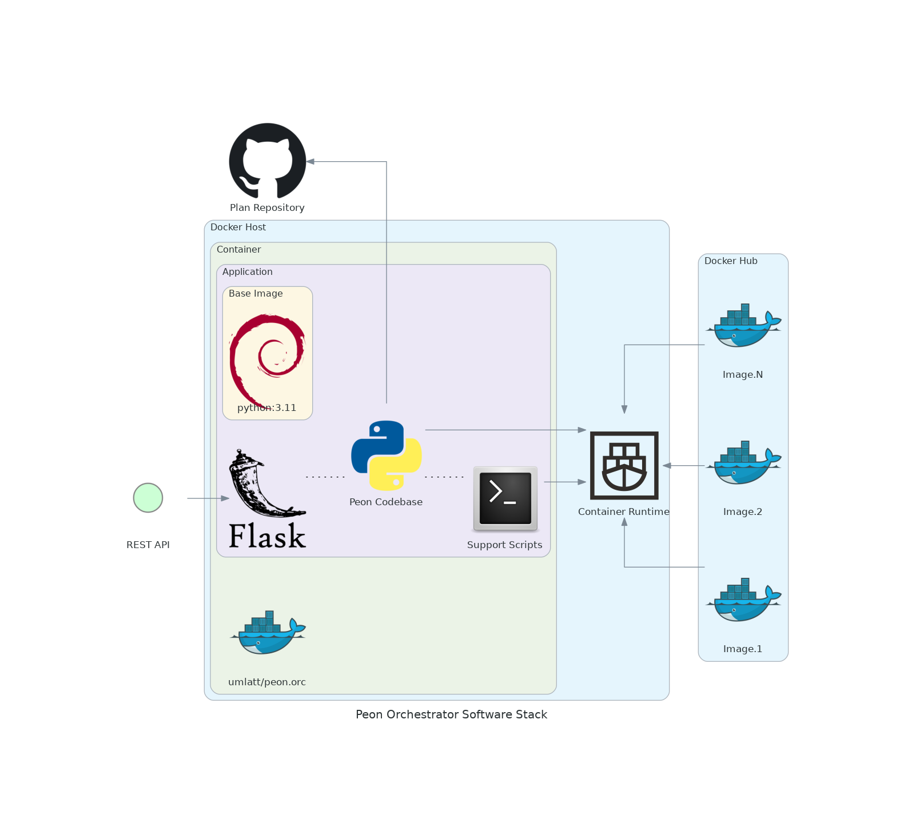

# Orchestrator

The Orc (orchestrator) module is the heart of the project.

It is what manages the process of game server deployment for users.

---

## Design Objectives

- Extremely lightweight.
- [REST API managed](../guides/02_rest_api.md)
- Deploy/control game containers.
- Abstracted from the game server/container platform to allow stack evolution.

---

## Software Stack Diagram

*\*This may change as technologies & skills evolve.*

---

## Dev Notes

[HTML Response Codes](https://www.restapitutorial.com/httpstatuscodes.html)

---

## Navigation

Links to various project-related resources.

---

## Features

- [x] User file backups
- [x] Update to new deployment architecture.
- [x] RESTapi (v1) - Plan/recipies
- [x] Security - api-key integration
- [x] Start/Stop scheduler
- [x] RESTapi (v1) - custom configurations
- [x] Server deployment (v2) - custom configurations
- [x] Persistent server data - Keep server data for updates & future releases.
- [x] RESTapi (v1)
- [x] Server deployment (v1)

---

## Roadmap

Here are some planned features

- [ ] Security - Add `fail2ban` to REST API
- [ ] Security - Users & Audit Logging
- [ ] RESTapi (v1) - Console

---

## Release Notes

**1.3.0 - DEVELOPMENT**

**:zap: IMPACT RELEASE :zap:**

- [ ] ADDED :new: API - `Modify` to allow editing the existing server's settings.

- [x] ADDED :new: API - Update flag `reinit/full/image/server`. Setting the flag to `server` update will just update the game server, setting `image` update will update the container, `full` will update the `image` and `server` and `reinit` will delete the server data (not user data) and then run a `full`
- [x] ADDED :new: Check for consumed ports in start response (import docker compose config as yaml and check docker ps output)
- [x] ADDED :new: Get container build/version info using docker exec, instead of as part of container deploy
- [x] ADDED :new: Scheduler auto cleans missing/completed tasks
- [x] ADDED :new: API - Get current orchestrator version
- [x] CHANGED :tools: The `getall` servers is now gameuid,servername sorted by default
- [x] BUGFIX :beetle: Fixed an issue to the server import function, where it would try start a server with a non-existant `docker-compose.yml` file
- [x] BUGFIX :beetle: Enforced project specific docker-compose commands to avoid conflicting networks/configs
- [x] BUGFIX :beetle: Fixed an issue where a scheduled `stop` would not respond correctly.

**1.2.11**

- [x] CHANGE :tools: Updated to latest OS/package combinations.

**1.2.10**

- [x] ADDED :new: Ability to import any game servers

**1.2.9**

- [x] ADDED :new: Added backup save to `/home/peon/backup`
- [x] ADDED :new: Ability to download user and config data for a game server (via `/home/peon/backup`).

**1.2.8**

- [x] BUGFIX :beetle: Enforced UID 1000 on all folders in the server directory (on create and on docker-compose action)

**1.2.7**

- [x] ADDED :new: Ability to update the game server using the API.

**1.2.6**

- [X] LOGGING :speech_balloon: Improve logging response to handle bad JSON/missing files on plan load.

**1.2.5**

- [x] BUGFIX :beetle: Repaired an issue with a plan not seeing a description

**1.2.4**

- [x] CHANGED :tools: Updated how the cli tool references files inside the container

**1.2.3**

- [x] BUGFIX :beetle: Make better alert when the folder already exists, not `action not supported`

**1.2.2**

- [x] ADDED :new: Ability to make custom REST API key through env vars.

**1.2.1**

- [x] ADDED :new: Added `skip` flag to `Server PUT` to force bypass of actions (if required)
- [x] BUGFIX :beetle: Added return on successful create when not start is requested.

**1.2.0**

**:zap: IMPACT RELEASE :zap:**

- [x] CHANGED :tools: Changed URL path from `/api/1.0` to `/api/v1`
- [x] CHANGED :tools: Added sort to `get_plans`

**1.1.0**

**:zap: IMPACT RELEASE :zap:**

- [x] CHANGED :tools: Moved logging into container logs
- [x] ADDED :new: Added `DEV_MODE` flag to enable/disable logging/dev mode.

**1.0.5**

- [x] BUGFIX :beetle: Fixed API destroy + **eradicate** of a server.

**1.0.4**

- [x] ADDED :beetle: Check if the environment variable `HOST_DIR` is empty.
- [x] ADDED :new: Added a *clean on failure* when a server creation is triggered.
- [x] ADDED :new: Added an API flag `noclean` to disable *clean on failure*.
- [x] BUGFIX :beetle: Fixed issue where failures on `docker compose` commands did not get handled by API correctly.
- [x] BUGFIX :beetle: Fixed an issue where generic failure was being reported back via API when plans were being generated.
- [x] LOGGING :speech_balloon: Added additional step logging for *debug* logging to assist in fault finding.

**1.0.3**

- [x] BUGFIX :beetle: Updated API for use with Discord bot.

**1.0.2**

- [x] CHANGE :tools: Re-enabled stop scheduler.
- [x] REMOVED :scissors: Disabled API debug mode (as it causes issues with the scheduler)

**1.0.1**

- [x] BUGFIX :beetle: Removed `docker-compose create` from API when no start is selected.
- [x] BUGFIX :beetle: Updated to `docker compose` from `docker-compose` paradigm

**:zap: IMPACT RELEASE :zap:**

**1.0.0**

- [x] CHANGE :tools: Plans - Reworked entire plans module for docker-compose architecture
- [x] CHANGE :tools: Servers - Reworked entire servers module for docker-compose architecture
- [x] CHANGE :tools: API - Updated API for docker-compose architecture.
- [x] BUGFIX :beetle: All - fixed several issues after rework
- [x] ADDED :new: warcamp - cleanup
- [x] ADDED :new: get_warcamp - check container state and update state accordingly.
- [x] CHANGE :tools: `CURRENT_TASK` API - Deploy server from API call. (Untested `server create` function)
- [x] ADDED :new: API - Plan - Get required settings
- [x] CHANGE :tools: Change to SVN download for directory (plans)
- [x] CHANGE :tools: Moved to `docker compose` based model for better re-usability/clarity.
- [x] CHANGE :tools: API - Removed servers/server marshall flow for more versatile response handling
- [x] BUGFIX :beetle: API - Plans - Fixed the get and update from server plans

**0.3.2**

- [x] ADDED :new: Added `/app/bin` to the path and added `peon` cli module into orc.
- [x] CHANGE :tools: Make API key configurable

**0.3.1**

- [x] CHANGE :tools: Rework Orchestrator app to leverage the `docker.sock`
- [x] CHANGE :tools: Moving to init script `init/peon.orc`, for pre-flight checks.
- [x] REMOVED :scissors: Removed SSH check on boot from `python3 main.py`
- [x] ADDED :new: Configurable docker socket path.
- [x] ADDED :new: Added `VERSION` environment variable into the container.

**0.3.0**

- [x] CHANGE :tools: Change the docker file to support using `docker.sock` socket file to manage docker (from SSH)

**0.2.17**

- [x] BUGFIX :beetle: Remove schedule on manual stop
- [x] CHANGE :tools: Validate epoch time input for scheduler epoch time

**0.2.16**

- [x] BUGFIX :beetle: Server create returned false error due to change error dict handler

**0.2.15**

- [x] BUGFIX :beetle: Scheduler vs Start/Stop

**0.2.14**

- [x] BUGFIX :beetle: Scheduler v1.0 - Bugfix (server stop is now properly scheduled)

**0.2.13**

- [x] ADDED :new: Scheduler - v1.0 - Added simple start & delayed stop in scheduler

**0.2.12**

- [x] CHANGE :tools: API Response - Server config

**0.2.11**

- [x] ADDED :new: PUBLIC_IP - added to container variables

**0.2.10**

- [x] Logging - Added devMode switch

**0.2.9**

- [x] ADDED :new: UI - Added MOTD to container login

**0.2.8**

- [x] CHANGE :tools:  Base images were pulled to get the latest versions & app was rebuilt on those
- [x] BUGFIX :beetle: Incorrect parameter reference in server create

**0.2.7**

- [x] SECURITY :unlock: Inital CORS implementation
- [x] SECURITY :unlock: Initial api-key requirement implementation

**0.2.6**

- [x] ADDED :new: API - Server - Destroy & Eradicate

**0.2.5**

- [x] ADDED :new: API - Server - Reworked to include actions into the path
- [x] ADDED :new: API - Server - Added get with metrics

**0.2.4**

- [x] ADDED :new: API - Server Get - reworked to provide both container & server state

**0.2.3**

- [x] ADDED :new: API - Auto download latest plan version when the server is deployed

**0.2.2**

- [x] ADDED :new: API - Plans get list & update from Peon project list

**0.2.1**

- [x] BUGFIX :beetle: Enforced description & settings on [post]servers

**0.2.0**

- [x] ADDED :new: Added custom config handler
- [x] CHANGE :tools: Allows configuration of environment variables in the container (via API)
- [x] ADDED :new: Can supply json/txt files via API
- [x] ADDED :new: Added persistent description

**0.1.6**

- [x] ADDED :new: Added handler for `config` folder
- [x] ADDED :new: Moved game server logs into the game server directory

**0.1.5**

- [x] INITIALISED :airplane: The first iteration of server create (API)
