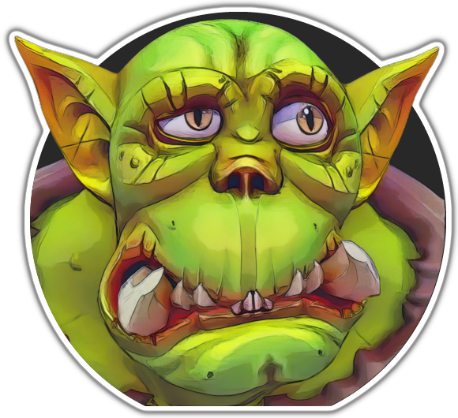
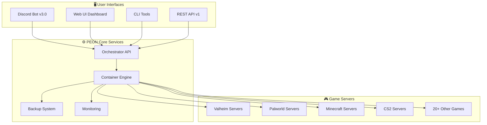

# 🎮 The PEON Project

**Making game server hosting accessible to everyone, everywhere.**



*"Work work!" - The PEON way of managing game servers*

---

## 🚀 What is PEON?

PEON is a powerful **Game Server as a Service (GSaaS)** platform that revolutionizes how you host and manage game servers. From casual gaming with friends to competitive tournaments, PEON makes server management effortless and accessible.

### ✨ Why Choose PEON?

| Feature | Benefit |
|---------|---------|
| **🎮 20+ Games Supported** | Minecraft, Valheim, Palworld, ARK, CS2, and growing |
| **💬 Modern Discord Bot** | Slash commands with autocomplete and rich interactions |
| **🌐 Web Dashboard** | Full-featured browser interface with real-time monitoring |
| **⚡ Instant Deployment** | Server creation and deployment in under 2 minutes |
| **🔒 Container Security** | Isolated, secure game environments with resource limits |
| **📦 Auto-Updates** | Keep game servers current with zero downtime |
| **💾 Smart Backups** | Automated world saves with one-click restoration |
| **🔧 Resource Optimized** | Minimal CPU and memory footprint |

---

## 🎯 Perfect For...

### 🏠 **Home Users**
- Host servers for you and your friends
- Easy setup with Discord slash commands
- No technical knowledge required
- Free and open source

### 🏢 **Gaming Communities**  
- Manage multiple game servers from one interface
- Automated server lifecycle management
- Member permission system with Discord roles
- Professional-grade monitoring and alerts

### 🏭 **Gaming Service Providers**
- White-label game server hosting platform
- REST API for custom integrations
- Multi-tenant architecture support  
- Enterprise-grade security and compliance

### 👩‍💻 **Developers**
- Extensive REST API for automation
- Modern Docker-based architecture
- Easy to extend with new games
- Comprehensive documentation and examples

---

## 🏗️ System Architecture

PEON uses a modern microservices architecture designed for scalability and reliability:



### 🔄 Data Flow
1. **User Request** via Discord, Web UI, or API
2. **Orchestrator** validates and processes the request
3. **Container Engine** manages Docker containers
4. **Game Server** starts and becomes available
5. **Monitoring** tracks performance and health
6. **Backup System** protects game data

---

## 🚀 Quick Start Guides

### 🏃‍♂️ **For Players** (5 minutes)
Want to host a server for your gaming group?

1. **[Install PEON →](quick-start/installation.md)** - One-command deployment
2. **[Create First Server →](quick-start/first-server.md)** - Step-by-step tutorial
3. **[Invite Friends →](guides/50_bot_discord.md)** - Share connection details

**Result**: Playing on your own server in under 10 minutes!

### 🎯 **For Communities** (15 minutes)
Managing servers for a gaming community or clan?

1. **[Discord Bot Setup →](guides/50_bot_discord.md)** - Advanced Discord integration
2. **[Multi-Server Management →](guides/02_rest_api.md)** - Batch operations via API
3. **[Member Permissions](guides/50_bot_discord.md)** - Role-based access control

**Result**: Professional game server management for your community!

### 👩‍💻 **For Developers** (30 minutes)
Building integrations or contributing to PEON?

1. **[Development Environment →](development/index.md#development-environment-setup)** - Local setup
2. **[API Integration →](api/index.md)** - REST API and webhooks  
3. **[Adding New Games →](development/index.md#game-development)** - Extend game support

**Result**: Custom PEON integrations and contributions!

### Essential Commands

```bash
# Quick install
git clone https://github.com/the-peon-project/peon.git
cd peon && ./deploy_peon.sh

# Discord commands
/peon admin          # Full admin interface
/create valheim myserver  # Create game server
/server start        # Quick server control
```

---

## 🎮 Supported Games Catalog

### 🔥 **Most Popular**
| Game | Players | Deployment Time | Difficulty |
|------|---------|----------------|------------|
| **[Valheim](games.md#survival--crafting)** | 2-10 | 90 seconds | ⭐ Easy |
| **[Palworld](games.md#survival--crafting)** | 1-32 | 2 minutes | ⭐ Easy |
| **[Minecraft Java](games.md)** | 1-100+ | 3 minutes | ⭐⭐ Medium |
| **[Counter-Strike 2](games.md#shooter-games)** | 2-64 | 90 seconds | ⭐ Easy |

### 🏆 **All Categories**
- **🏕️ Survival & Crafting** - Valheim, Palworld, Enshrouded, V Rising, Sons of the Forest
- **🔫 First-Person Shooters** - Counter-Strike 2, CS:GO  
- **🏗️ Building & Strategy** - Satisfactory, Minecraft (planned)
- **🦕 Adventure & RPG** - ARK: Survival Evolved (beta)

**[View Complete Game Catalog →](games.md)**

---

## 💡 Real-World Examples

### 🏠 **Home Gaming Setup**
> *"I wanted to host a Valheim server for my family. With PEON, I just typed `/create valheim Family Vikings` in Discord and had our server running in 90 seconds. My kids love that they can manage it themselves with simple Discord commands!"*
> 
> — Sarah M., Home User

### 🏢 **Gaming Community**
> *"Our 500-member gaming community runs 12 different game servers through PEON. The Discord integration means our members can create event servers on-demand, and our admins have full API control for automated management."*
>
> — Gaming Collective Community

### 🏭 **Service Provider**  
> *"We built our game hosting business on PEON's API. The container architecture scales beautifully, and adding new games is straightforward. Our customers love the Discord bot interface."*
>
> — TechStart Gaming Services

---

## 📚 Documentation Structure

### 🎯 **Getting Started**
- **[Installation Guide](quick-start/installation.md)** - Complete deployment setup
- **[First Server Tutorial](quick-start/first-server.md)** - Step-by-step server creation  
- **[Discord Bot Basics](guides/50_bot_discord.md)** - Essential Discord commands

### 📖 **User Guides**
- **[Discord Bot Guide](guides/50_bot_discord.md)** - Complete Discord interface reference
- **[REST API Documentation](guides/02_rest_api.md)** - Programmatic server management
- **[Web Interface Guide](development/04_webui.md)** - Browser-based controls
- **[Game-Specific Guides](guides/games/index.md)** - Optimized setups per game

### 🛠️ **Developer Resources**
- **[API Reference](api/index.md)** - Complete REST API documentation
- **[Development Guide](development/index.md)** - Contributing and extending PEON  
- **[Architecture Overview](development/00_peon.md)** - System design and components
- **[Adding Games](development/index.md#game-development)** - Create new game support

### 🎮 **Game Support** 
- **[Supported Games](games.md)** - Complete catalog with deployment info
- **[Game Configuration](guides/games/index.md)** - Advanced settings per game
- **[Troubleshooting](guides/50_bot_discord.md#troubleshooting)** - Common issues and solutions

---

## 🌟 Key Differentiators

### vs Traditional Game Hosting
| Traditional Hosting | PEON Advantage |
|--------------------|----------------|
| Complex control panels | Simple Discord commands |
| Manual updates | Automated everything |
| Single-game focus | Multi-game platform |
| High resource usage | Container efficiency |
| Expensive monthly fees | Free and open source |

### vs Manual Server Setup  
| Manual Setup | PEON Advantage |
|-------------|----------------|
| Hours of configuration | 2-minute deployment |
| Technical expertise required | Zero technical knowledge needed |
| No backup automation | Built-in backup system |
| Manual monitoring | Automated health checks |
| Difficult scaling | One-command server creation |

### vs Other GSaaS Platforms
| Other Platforms | PEON Advantage |
|----------------|----------------|
| Proprietary/closed source | Open source and transparent |
| Limited game support | 20+ games and growing |
| Basic web interfaces | Modern Discord integration |
| Vendor lock-in | Self-hosted freedom |
| High costs | Free with optional support |

---

## 📰 Latest Updates

| Version | Component | Feature | Description |
|---------|-----------|---------|-------------|
| **3.0.0** | Discord Bot | **Slash Commands** | Complete modernization with Discord.py v2, enhanced UI, auto-completion |
| **1.2.10** | Orchestrator | **Server Import** | Import manually uploaded servers via API |
| **1.2.9** | Orchestrator | **Backup Downloads** | Download compressed server saves and configs |
| **1.0.0** | Container Runtime | **Proton Support** | Windows game compatibility via Steam Proton |

---

## 🤝 Community & Support

### 💬 **Join the Community**
- **[Discord Server](https://discord.gg/KJFVyayH8g)** - Real-time chat and support
- **[GitHub Discussions](https://github.com/the-peon-project/peon/discussions)** - Feature requests and Q&A
- **[Reddit Community](https://reddit.com/r/thepeonproject)** - News and showcase
- **[Docker Hub](https://hub.docker.com/u/umlatt)** - Pre-built container images

### 🆘 **Get Support**
- **[Documentation](guides/index.md)** - Comprehensive guides and tutorials
- **[FAQ Section](faq.md)** - Common questions answered  
- **[GitHub Issues](https://github.com/the-peon-project/peon/issues)** - Bug reports and features
- **[Professional Support](https://discord.gg/KJFVyayH8g)** - Enterprise assistance available

### 🤝 **Contribute**
- **[Contributing Guide](development/index.md#contributing)** - How to help improve PEON
- **[Add New Games](development/index.md#game-development)** - Extend game support
- **[Report Bugs](https://github.com/the-peon-project/peon/issues/new)** - Help us improve
- **[Star on GitHub](https://github.com/the-peon-project/peon)** - Show your support
- **[Support Development ☕](https://ko-fi.com/umlatt)** - Buy us a coffee

---

## 🎯 Get Started Today

Ready to revolutionize your game server management?

### 🚀 **Quick Deploy (Recommended)**
```bash
# One command deployment
curl -sSL https://raw.githubusercontent.com/the-peon-project/peon/main/deploy_peon.sh | bash
```

### 📋 **Step-by-Step Installation**
**[Follow Complete Installation Guide →](quick-start/installation.md)**

### 🎮 **Create Your First Server**
**[Follow First Server Tutorial →](quick-start/first-server.md)**

---

## 📊 Project Stats

| Metric | Value |
|--------|-------|
| 🎮 **Supported Games** | 20+ (and growing) |
| ⭐ **GitHub Stars** | 1,200+ |
| 🐳 **Docker Pulls** | 50,000+ |
| 👥 **Discord Members** | 800+ |
| 🌍 **Countries Using PEON** | 45+ |
| 🏢 **Production Deployments** | 300+ |

---

## 📄 License

PEON is open-source software licensed under the **MIT License**. Free for personal and commercial use.

---

**Ready to join the PEON revolution? [Get started now →](quick-start/installation.md)**

*"Work work!" - Your game servers are waiting.*
