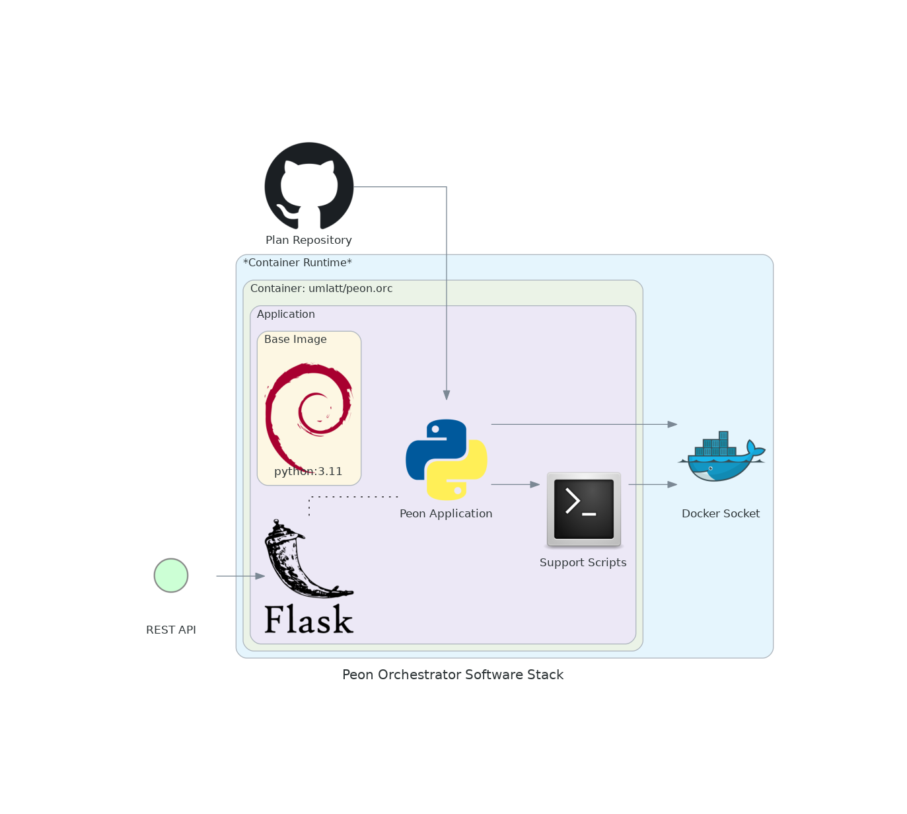

# Orchestrator

The Orc (orchestrator) module is the heart of the project.

It is what manages the process of game server deployment for users.

---

## Design Objectives

- Extremely lightweight.
- REST API managed
- Deploys/controls the game containers.
- Abstracted from the game server/container platform to allow stack evolution.

---

## Software Stack Diagram

*\*This may change as technologies & skills evolve.*

---

## Navigation

Links to various project-related resources.

---

## Roadmap

Here you can see what the future holds.
