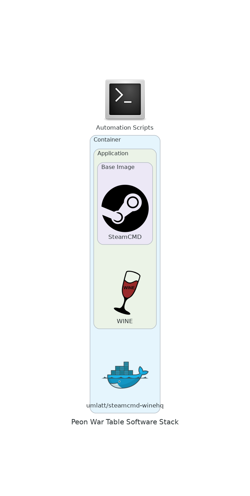

# War Table

The **War Table** module works in conjunction with the Orchestrator to provide the relevant tools for the game containers.

This project handles the tools that are shared between game containers.

## Projects

[*Contained Steam*](https://github.com/the-peon-project/peon-wartable/tree/master/containers/steamcmd) (steamcmd) are scripts to automate/update `steamcmd` and the game server files (within a steamcmd based docker container), as part of the PEON automation services.

[*Steamed Wine*](https://github.com/the-peon-project/peon-wartable/tree/master/containers/steamcmd-wine) (steamcmd+winhq) is a custom container to facilitate game servers that are only built for windows OS, within the PEON toolsuite.

---

## Design Objectives

1. Only scripts/code to be store here. Large file pulls should be done from other sources.
2. Attempt to keep the code pool as generic as possible to maximize code re-use/supportability.
3. If something already exists and is open source don't rewrite needlessly.

---

## Software Stack Diagram

*\*This may change as technologies & skills evolve.*

---

## Navigation

Links to various project-related resources.

---

## Roadmap

Here you can see what the future holds.
