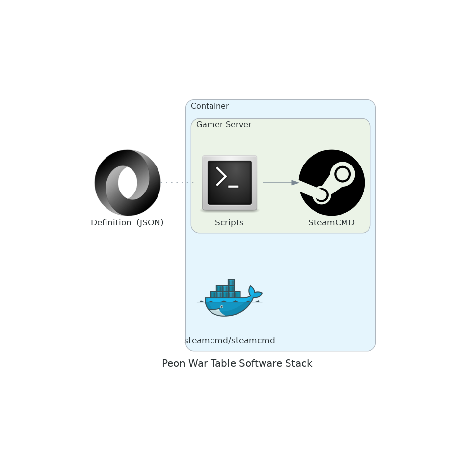

# War Plans

The **War Plan** module works in conjunction with the Orchestrator to deploy specific game servers upon request.

This project handles the unique game recipes.

## Projects

For the list of supported games please go [here](../games.md)

---

## Design Objectives

1. Try to confine recipe definitions to a simple `docker-compose.yml` file and a `.env` where possible.
2. Use the below *Image build hierarchy* definition to decide on the best course of action.

### Image build hierarchy

*\*Official container images are usually bespoke, so it may take some additional modification to the wider PEON app stack, which is not desirable.*

1. Use pre-existing generic PEON container image/s *if exists*
2. Log a request for enhancement to improve the exisiting builds (if possible)
3. Use an official game server container image *if exists*, but add the PEON tweaks to the build \*
4. Alternatively Create a PEON compliant container

---

## Software Stack Diagram

*\*This may change as technologies & skills evolve.*

---

## Navigation

Links to various project-related resources.

---

## Roadmap

Here you can see what the future holds.
