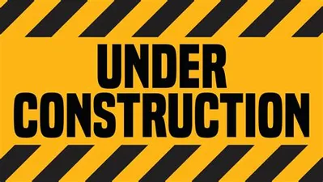

# Web UI

The Web UI module is a supplimental service to the PEON project.

This is a user frontend (website) for managing PEON War Camps.

---

## Design Objectives

- Extremely lightweight.
- Aesthetic design principles
- Controls remote systems through REST

---

## Software Stack Diagram

*\*This may change as technologies & skills evolve.*

---

## Navigation

Links to various project-related resources.

---

## Roadmap

Here you can see what the future holds.
