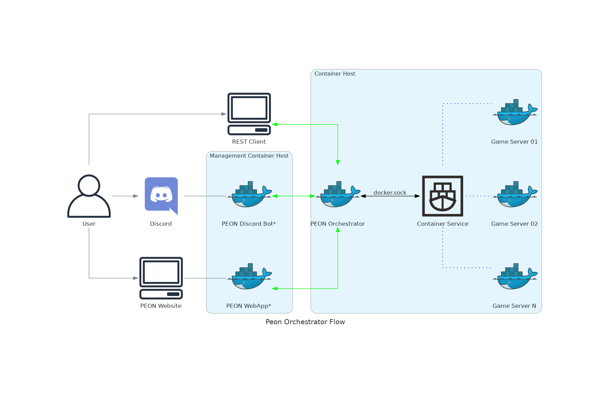

# Introduction

Welcome to the **DEVELOPMENT** documentation.

Here you can get an overview of how the PEON project is architected, where to go and how to use all of the various tools and code that has been built thus far.
*Please note that documentation may lag behind the development status, but the general rules/intent should still be valid.*

## Architecture

This diagram shows off the basic architecture of the PEON project.

*At it's core, everything revolves around the Orcs.*

- REST API - The orchestrator can be managed by a REST API, with is represented with orange connection/s.
- DOCKER SOCKET - The orchestrator manages the underlying docker host using docer sockets (at the moment), which is represented with red connection/s.
- \*Optional Feature - These are not *required* in order to leverage the automation services of the PEON project.

## Terms & Symbols

### Terms & Acronyms

| Term/Acronym | Definition |
|-|-|
| Orc | The orchestration component of the PEON project. |
| War Table | The PEON component responsible for shared services around the game servers. |
| War Plan | These are the game server recipies. |
| WebUI | A website client built for the sole purpose of managing instances of *Orc*s |
| War Camp | A name for a container host that is running an *Orc* |
| War Chief | A name for a module that manages multiple *War Camps* |

## Tools & Technologies

Below, is a list of the various tools and technologies leveraged in the development process for the PEON project.

### Documentaion

#### Material for MkDocs

[Project Link](https://squidfunk.github.io/mkdocs-material/)

We are using `mkdocs-material` as the basis for our documentation framework, as it is markdown compliant and requires minimal maintenance to provide aesthetically pleasing documentation.

##### Logo/Symbol Search

If you need find find a logo/symbol that exists in the `mkdocs-material` platform a useful link is [here](https://squidfunk.github.io/mkdocs-material/reference/icons-emojis/)

---

### Diagram Design

#### Python Diagrams

[Project Link](https://diagrams.mingrammer.com/docs/getting-started/examples)

We are using the *diagrams* module for python. It offers the ability to dynamically generate dyagrams programmatically. *There is a built in (Material for MkDocs) programmatic diagram software, however initial investigations did not appear to provide as aesthetic a design as Python Diagrams*
