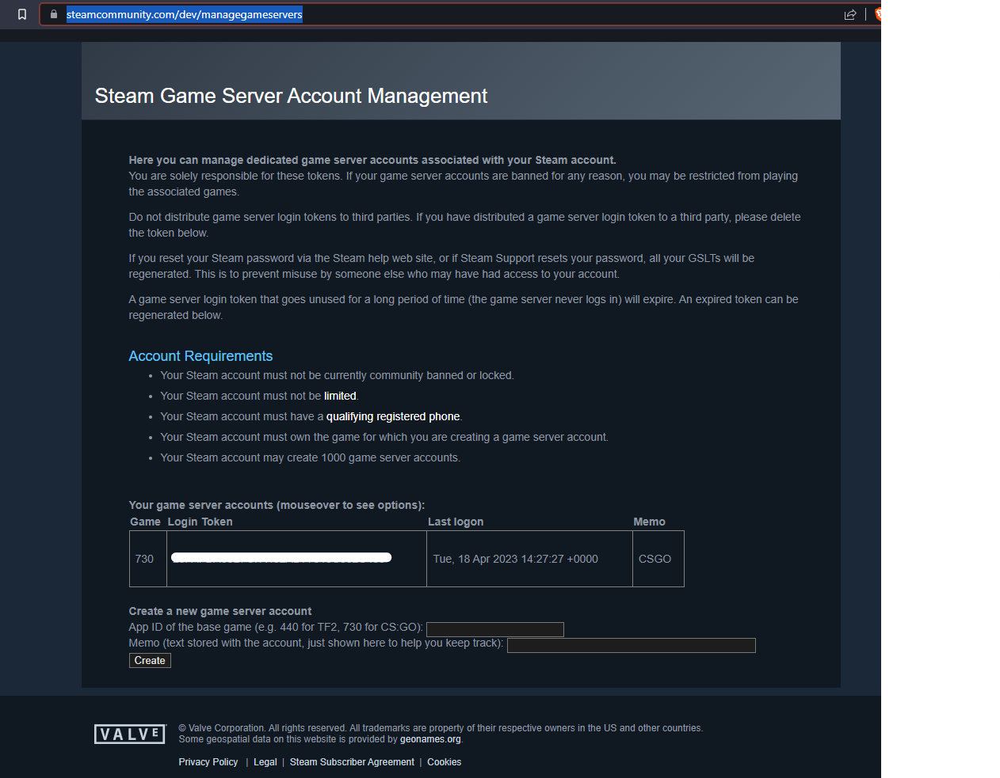

# Introduction

Here you can find out how to use the servers, as they are built.

Please note that you will be linked to the official docs where possible, as we don't want to deviate from the original where possible.

## Steam Things

### Login Token

Some games require you to register a Token with Steam that is used to register against thier servers (e.g. CSGO).

Go to [get my login token](https://steamcommunity.com/dev/managegameservers) to create one.

Fill in the boxes below and click create. You will get a `login token` which is all you need.

You can then set this in the `.env` file for the server, in the `./peon/servers/[game_uid]/[server_name]/` directory.

